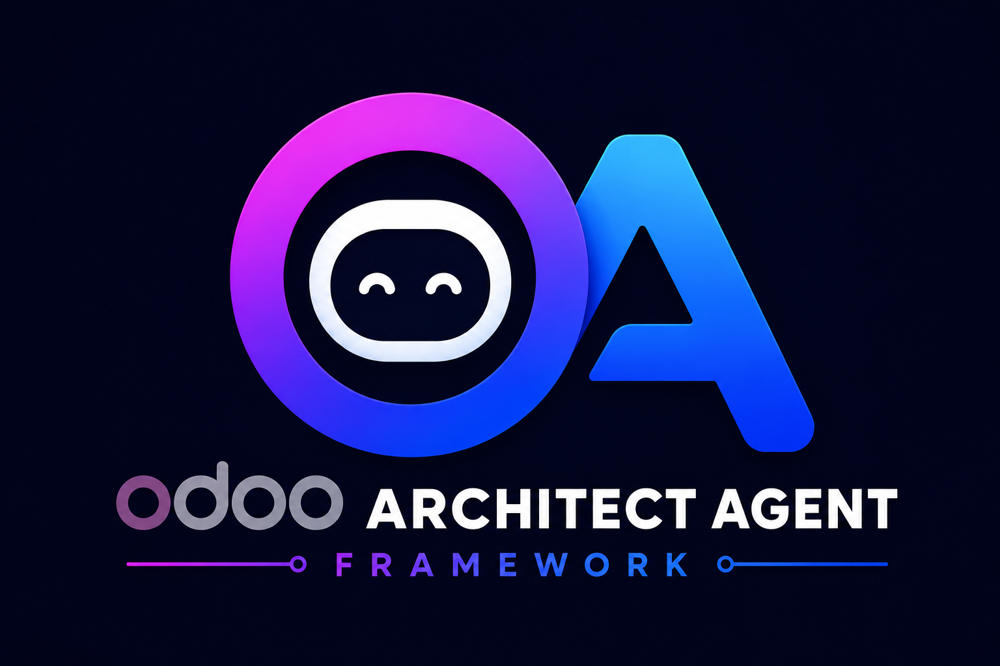
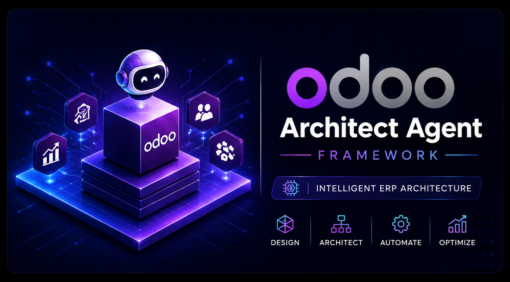

# Odoo Architect Agent Framework

<p align="center">
  
</p>

[](LICENSE)
[](pyproject.toml)
[](docs/production-readiness.md)

An open-source agent framework and CLI for building production-minded Odoo custom addons.

The goal is simple: give AI coding agents a disciplined Odoo engineering layer so they behave less like generic chatbots and more like senior Odoo architects.

<p align="center">
  
</p>

## What It Does

Odoo Architect helps agents and developers:

- Design upgrade-safe Odoo custom addons.
- Scaffold hub and industry extension modules.
- Follow Odoo ORM, XML inheritance, security, and testing conventions.
- Share one set of instructions across Codex, Claude Code, Antigravity, OpenCode, and Copencode-style tools.
- Validate framework structure, manifests, XML, Python files, access CSVs, skill files, and CLI packaging.
- Run live Odoo install/update smoke tests through Docker Compose.

## Project Status

Current status: **release candidate**.

Static validation and CLI tests pass. Full production certification requires successful live Odoo 18 and Odoo 19 install/update smoke tests.

See:

- [Production Readiness](docs/production-readiness.md)
- [Validation Report](docs/validation-report.md)
- [Live Odoo Validation](docs/live-odoo-validation.md)

## Installation

Requirements:

- Python 3.10 or newer.
- Git.
- Docker and Docker Compose v2 for live Odoo smoke tests.

Clone the repository:

```bash
git clone https://github.com/omersx/odoo-architect-agent-framework.git
cd odoo-architect-agent-framework
```

Install the CLI:

```bash
python -m pip install -e .
```

Check that it works:

```bash
odoo-architect info
odoo-architect doctor
odoo-architect validate
```

On Windows PowerShell, you can also run it from source without installing:

```powershell
$env:PYTHONPATH = "src"
python -m odoo_architect_cli info
```

See the full guide: [Install and Use](docs/install-and-use.md).

## Repository Structure

```text
.
|-- src/odoo_architect_cli/          # CLI package
|-- examples/custom_addons/          # Reference Odoo addons
|-- system/                          # Core engineering rules
|-- workflows/                       # Repeatable delivery workflows
|-- patterns/                        # Odoo technical patterns
|-- templates/                       # Prompt and addon templates
|-- industries/                      # Industry playbooks
|-- checklists/                      # Quality gates
|-- integrations/                    # Tool integration guides
|-- .codex/                          # Codex skill adapter
|-- .agents/                         # Antigravity-style adapter
|-- .opencode/                       # OpenCode/Copencode adapter
|-- .claude/                         # Claude Code command adapter
|-- tools/                           # Static validators
|-- scripts/                         # Windows/Linux/macOS command wrappers
|-- tests/                           # CLI unit tests
`-- docs/                            # Production, platform, CLI, and publishing docs
```

## Quick Start

After installing, create a new Odoo extension addon:

```bash
odoo-architect scaffold biz_bridge_pharmacy --extension --depends stock,product_expiry,point_of_sale
```

Review the reference addon:

```bash
odoo-architect review examples/custom_addons/biz_bridge_pro
```

Run local checks:

```bash
odoo-architect validate
```

## CLI Commands

```bash
odoo-architect info
odoo-architect doctor
odoo-architect validate
odoo-architect review examples/custom_addons/biz_bridge_pro
odoo-architect scaffold biz_bridge_pharmacy --extension --depends stock,product_expiry,point_of_sale
odoo-architect smoke-test --odoo-version 18.0 --database odoo_architect_test_18
```

See the full CLI guide: [docs/cli.md](docs/cli.md).

## Validate Locally

Windows:

```powershell
.\scripts\test.ps1
.\scripts\validate.ps1
```

Linux/macOS:

```bash
bash scripts/test.sh
bash scripts/validate.sh
```

or:

```bash
make test
make validate
```

## Live Odoo Smoke Tests

Windows:

```powershell
.\scripts\odoo-smoke-test.ps1 -OdooVersion 18.0 -Database odoo_architect_test_18
.\scripts\odoo-smoke-test.ps1 -OdooVersion 19.0 -Database odoo_architect_test_19
```

Linux/macOS:

```bash
make smoke-test-18
make smoke-test-19
```

These commands install and update the reference addon in a Dockerized Odoo database with tests enabled.

## Agent Integrations

The framework is intentionally tool-agnostic.

- Codex: [.codex/skills/odoo-architect/SKILL.md](.codex/skills/odoo-architect/SKILL.md)
- Claude Code: [CLAUDE.md](CLAUDE.md)
- Antigravity: [ANTIGRAVITY.md](ANTIGRAVITY.md) and [.agents/](.agents)
- OpenCode: [OPENCODE.md](OPENCODE.md) and [.opencode/agents/odoo-architect.md](.opencode/agents/odoo-architect.md)
- Copencode-style tools: [COPENCODE.md](COPENCODE.md)
- Generic agents: [SYSTEM.md](SYSTEM.md) and [AGENTS.md](AGENTS.md)

## Reference Addon

The included reference addon is [biz_bridge_pro](examples/custom_addons/biz_bridge_pro).

It demonstrates a small hub module connecting CRM, Sales, Inventory, and Accounting:

- Sales order delivery urgency.
- Live stock check button.
- Delivery urgency copied from quotation to invoice.
- Delivery urgency visible on related warehouse transfers.
- Draft quotation creation when a CRM opportunity reaches the configured qualified stage.

The addon depends on `sale_crm` because the quotation-to-opportunity relationship is provided by Odoo's standard CRM/Sales bridge.

## Architecture

Use a hub-and-spoke pattern:

```text
custom_addons/
  biz_bridge_pro          # Generic hub
  biz_bridge_pharmacy     # Industry spoke
  biz_bridge_construct    # Industry spoke
  biz_bridge_retail       # Industry spoke
```

Shared rules live in the framework. Industry modules depend on the hub and add only domain-specific behavior.

## Documentation

- [Vision](docs/vision.md)
- [Install and Use](docs/install-and-use.md)
- [CLI Guide](docs/cli.md)
- [Platform Support](docs/platform-support.md)
- [Production Readiness](docs/production-readiness.md)
- [Live Odoo Validation](docs/live-odoo-validation.md)
- [Publishing to GitHub](docs/publishing.md)
- [Public Release Checklist](docs/public-release-checklist.md)
- [Roadmap](ROADMAP.md)

## Contributing

Contributions are welcome.

Start with [CONTRIBUTING.md](CONTRIBUTING.md), run the validation commands, and keep Odoo customizations upgrade-safe, secure, and testable.

## Security

Please read [SECURITY.md](SECURITY.md). Do not open public issues for vulnerabilities.

## License

Licensed under LGPL-3.0-or-later. See [LICENSE](LICENSE).
